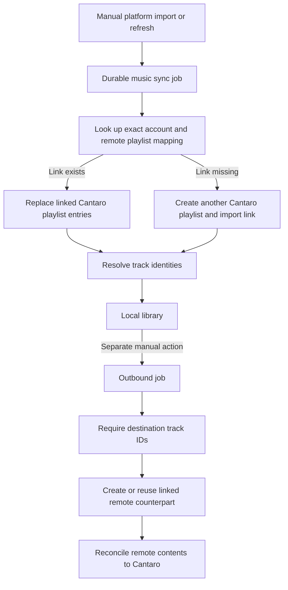
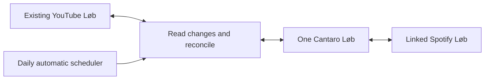

# Music playlist sync architecture

## Implemented flow

The implementation below supersedes the historical audit in this document.

1. Adding a provider playlist creates one Cantaro playlist and a link bound to the provider's account and playlist IDs. Adding it again reuses that identity. Existing remote playlists can be attached after a preview; an active link to another Cantaro playlist blocks the attachment.
2. `PlaylistSyncScheduler` uses persisted due times to run enabled playlists once a day. Each link also has a persisted retry time. A per-platform `Sync now` uses the same coordinator and only selects that platform.
3. `PlaylistSyncCoordinator` reads complete selected copies, compares each with its acknowledged baseline, and merges their changes into the canonical entries. A failed or incomplete selected read stops the write phase. Intentional removals propagate; unresolved omissions are absent from that destination's baseline and do not imply removal.
4. Destination lookup checks shared Cantaro identities before searching, using the existing identity resolver and matching engine. Accepted matches save the canonical song, source observation, provider IDs and playlist reconciliation together. Those identities are reusable by other playlists and users, including after a worker restart. Concurrent playlist lookups for the same observation are serialized within an API process and recheck the saved identity before searching. The writer sends the resolved subset and retains unresolved entries in Cantaro. Failed lookups remain checkpointed during an unfinished pass; a later daily run may search unresolved entries again.
5. Playlist membership and order updates preserve the IDs and added times of retained entries. Matching checkpoints use the saved post-resolution metadata, and retries count completed checkpoints and known destination identities before doing more work.
6. Each write rechecks the remote contents and canonical revision, records its intended contents, and verifies the result. An interrupted write keeps that intent so temporary omissions during a failed reorder are not imported as user deletions. A lease serializes work for the canonical playlist across application instances using the same database.
7. Missing counterparts are created for connected accounts. A durable reservation prevents repeated creation after an uncertain response. The user can attach the resulting remote playlist after reviewing it. A definite creation failure remains visible and can be retried.
8. Local edits update Cantaro and its revision. Daily runs propagate them; the old direct YouTube mutation path is removed. Repetitions are deduplicated by default. Enabling duplicates permits repeated entries, with removal targeted to an entry ID.
9. A rename first refreshes linked copies into Cantaro. Confirmation is bound to the resulting revision, account identities and names. Confirmed names become durable per-link work. Remote name changes require a decision before propagation. Rejected names are remembered. External applications can still rename their own copies; Cantaro cannot lock their interfaces.
10. Disconnect clears credentials and pauses links while retaining canonical playlists. Reconnecting the same account resumes its links; another account cannot inherit them. Unlink and disconnect reviews offer remote deletion where supported and canonical deletion when no other retained platform remains. Spotify's current API does not support remote playlist deletion.

`MusicPlaylistSync:Enabled=false` stops the background scheduler, including retries. `MusicPlaylistSync:AutomaticEnabled=false` stops daily discovery but retains explicitly queued work. Neither changes the manual endpoint's authorization. Use the first setting when validating against accounts whose remote playlists must remain untouched.

The migration binds existing mappings to their user and external account, retains their IDs, adopts old import links as two-way links, and schedules their first daily run one day later. Existing links begin without an invented baseline, so their first complete read combines contents instead of inferring historical removals.

Separate deployments with separate databases cannot coordinate their leases. Only one deployment should actively sync a given set of remote playlists. Another deployment can adopt existing copies through explicit attach; matching names never establish ownership.

Implementation: [coordinator](/D:/opensource/Cantaro/src/Cantaro.Api/Services/PlaylistSyncCoordinator.cs), [scheduler](/D:/opensource/Cantaro/src/Cantaro.Api/Services/PlaylistSyncScheduler.cs), [lifecycle](/D:/opensource/Cantaro/src/Cantaro.Api/Services/PlaylistLinkLifecycleService.cs), [migration](/D:/opensource/Cantaro/src/Cantaro.Api/Migrations/20260925194708_AddCanonicalPlaylistSync.cs).

### Validation on 25 September 2026

- The full backend suite passed 905 tests. The final rename guards then passed the 16-test lifecycle suite. Provider and coordinator tests use controlled provider responses and mutations, including partial writes, incomplete snapshots, account changes, duplicates, and retries.
- `bun run check` passed across ClientShared, Web and the browser extension. This includes 8 shared tests, 10 web tests and 245 extension tests, TypeScript checks, Web ESLint and production builds.
- `bun run check:fallow` passed its source-size and CSS checks, then stopped on the existing ClientShared findings: one duplicated media filter block and 12 complexity findings. Separate Web and extension Fallow checks passed. No suppression was added for new sync code.
- The migration passed a transactionally rolled-back dry run against development PostgreSQL, then applied through the Aspire migration service. All 9 playlists, 1,808 entries and 3 mappings remained intact. Existing mappings have the correct user and external account identities. EF reports no pending model changes.
- The API started healthy. The existing in-app browser showed one 32-song Løb, its two-way YouTube link, daily schedule, attach choices, unchecked deletion options, and consistent compact YouTube/Spotify cards. The 390-pixel layout had no horizontal document overflow. The browser reported no errors during the final check.
- Background playlist work was disabled during browser validation, then the original development configuration was restored. No live provider playlist was changed by validation. The three migrated playlists are scheduled for their first daily run on 26 September at 22:02 Europe/Copenhagen time, assuming the development app is running.

### PostgreSQL transaction fix on 25 September 2026

The first live manual sync exposed a failure the in-memory coordinator tests did not cover. Npgsql's retrying execution strategy rejected the coordinator's explicit transactions and returned HTTP 500. Import, link initialization, reconciliation and order resolution now use a shared atomic transaction scope that suppresses command-level retries. A failed attempt rolls back instead of replaying partially saved tracked entities. Provider calls remain outside the transaction. Transient database failures qualify for the scheduler's persisted retries, which start from a fresh context and provider read.

The existing backend suite passed 909 tests. Five new tests passed against an isolated PostgreSQL database with retries enabled, covering all four transaction paths and retention of the original entries after a replacement fails its foreign key constraint. Three new classifier tests passed for transient and permanent database failures. After restarting Aspire, a live YouTube sync of Løb completed at 22:15 on 25 September. The browser showed `Synced · 32 of 32 tracks`, with the error cleared and controls enabled.

### Shared matching on 26 September 2026

Canonical resolution and playlist destination lookup now call `TrackMatchDecisionEngine`. It applies the same metadata parser, scorer, identity-family grouping, threshold and ambiguity rules. Provider search clients still handle their own query syntax and transport. MusicBrainz also uses the shared decision to decide whether a search has enough evidence to stop. Local track reuse uses the same decision rules for metadata fallback while retaining provider-ID lookup and distinct-track collision checks.

YouTube imports and destination search results retain the video description separately from the uploader. `TrackObservationParser.ParseSearchHypotheses` uses `YouTubeDescriptionArtistEvidenceParser` to extract performer credits anchored to the song title. Those hypotheses feed provider queries and the shared scorer. Conflicting artist evidence blocks automatic acceptance. The original video's version and playback markers remain part of every derived hypothesis. The video description is not copied into canonical track descriptions.

An equivalent title, compatible artist credits and matching version can be accepted regardless of duration. Duration remains in diagnostics and helps select a representative among equivalent results; it can also support weaker title matches. It cannot reject an otherwise exact identity. Conflicting artist or version evidence and competing recording identities still require more evidence or an explicit user choice.

Existing observations without a description receive it on a subsequent complete YouTube read. This change does not rewrite previously accepted identities or force remote playlist writes. The earlier description experiment is historical; production regression tests cover the shared behavior.

The playlist match review also fetches missing YouTube description evidence on demand and stores it before searching. Its search field displays the preferred parsed title and artists. Submitting that unchanged suggestion uses automatic provider queries; an edited query uses the user's search text. Reviewing results does not save a track identity or write to a remote playlist.

Catalog title and artist fields remain separate when scored. A dash in a Spotify or MusicBrainz title does not introduce an artist credit. YouTube cover titles can drop clearly separated franchise context for search while retaining their cover markers, and an explicit `Cover Artist:` description credit identifies the performer rather than the source composer.

For exact-title catalog results with an ISRC, a missing explicitly featured credit can be accepted when every primary artist remains present. Missing primary collaborators, different performers and incompatible versions still block acceptance. A named `A x B (Creator Mashup)` can also match `A - B Edit` when both work names and the catalog creator agree. This does not make generic mashups, edits and remixes interchangeable.

Validation passed 1,013 backend tests; five PostgreSQL-specific tests were skipped without their test database configuration. Regression cases cover the 160/202-second Everything Goes On match, description-backed Mortals queries to Spotify and MusicBrainz, local track reuse, YouTube candidate descriptions, conflicting credits and alternate versions. Provider query tests use controlled responses, not live catalog calls. The Web Fallow check found no dead code or duplication.

## Historical audit and agreed design

Reviewed on 25 September 2026 before implementing the coordinator described above. This audit included the earlier uncommitted outbound-sync changes. The initial audit used read-only transactions. Following the user's review, the obsolete, unlinked 31-entry development Løb was deleted after verifying that all its entries remain in the linked 32-entry copy. No remote provider playlist was changed. The following sections retain the original findings and agreed requirements as historical context.

Cantaro has the basic entities for one playlist with several platform copies, but its current sync behavior does not implement that product model. It has manual imports, manual exports, and a separate YouTube-specific edit path. Playlist identity can be lost when account bindings disappear. Automatic change detection, reconciliation between independently edited copies, and propagation to every connected platform are missing.

The recent destination-picker correction made manual export safer. It did not complete the unified sync architecture described in AGENTS.md.

## The two Løb records

At the time of the audit, these were two persisted Cantaro playlists, not two cards for one playlist. The older row below has since been deleted at the user's request.

| Record | Created, UTC | Last updated, UTC | Entries | Current platform link |
| --- | --- | --- | --- | --- |
| `5234c1ed-a03b-4f68-8955-ee97b398cff3` | 15 Aug, 21:14 | 23 Aug, 14:34 | 31 | None |
| `81dbb863-9352-43a5-ab1b-57a026c5a3b9` | 30 Aug, 21:11 | 25 Sept, 18:11 | 32 | YouTube, `import_only` |

Both contain entries with `SourceService = youtube`. All 31 entries in the older playlist occur in the newer playlist at the same positions, matched by observation or canonical track identity. The newer playlist adds `TE PIENSO`, YouTube video `bn359vfUGRg`, at position 31. The current YouTube mapping points to playlist `PLhONi4_aXakn_iU-v5SqJmVlTASybxgHR` on connected account row 6.

The older playlist is therefore consistent with a stale import of the same playlist. Both records existed before today's UI changes; today's refresh updated the newer record to 32 entries.

The strongest historical explanation is the applied migration `20260830161236_BindMusicSyncJobsToAccountsAndAddHistory`. It explicitly deletes all playlist mappings and sync jobs while retaining playlists and their entries. The next import cannot find the old identity and creates a new playlist. Its date fits the newer Løb record. The database records that the migration ran, but not its execution timestamp or the deleted mapping, so the exact historical cause remains an inference. YouTube disconnect can produce a similar orphan by deleting the account and cascading deletion of its mappings.

The display adds confusion:

- `Cantaro only` means the API returned no mapping. It does not prove that the playlist was created in Cantaro or has no provider origin.
- YouTube import does not populate `Playlist.ImportedFromService`. Both Løb rows have a null value, despite their YouTube entries.
- The two pictures are stock fallback artwork selected by an ID hash. They are not evidence that these are different provider playlists.
- The directory says Cantaro keeps platform copies aligned, which overstates the implemented behavior.

Evidence: [mapping reset migration](/D:/opensource/Cantaro/src/Cantaro.Api/Migrations/20260830161236_BindMusicSyncJobsToAccountsAndAddHistory.cs:14), [YouTube mapping lookup and create](/D:/opensource/Cantaro/src/Cantaro.Api/Services/YouTubePlaylistSyncService.cs:91), [library projection](/D:/opensource/Cantaro/src/Cantaro.Api/Services/MusicLibraryQueryService.cs:50), [artwork selection](/D:/opensource/Cantaro/src/Cantaro.Web/src/music/musicPresentation.ts:72), [directory copy](/D:/opensource/Cantaro/src/Cantaro.Web/src/music/MusicPlaylistsDirectory.tsx:19).

## What is stored today

| Entity | Current responsibility | Limitation relevant to sync |
| --- | --- | --- |
| `Playlist` | Cantaro playlist ID, owner, name, description, timestamps, optional import origin | No canonical content revision or record of changes since the last sync |
| `PlaylistEntry` | Ordered membership referencing a canonical track and/or its provider observation | Import deletes and recreates entries; source occurrence identity is not preserved as a durable per-platform membership mapping |
| `ServicePlaylistMapping` | Links a Cantaro playlist to an external playlist, with account, mode and last-sync status | Tied to credential-account row lifetime; no common baseline for detecting independent edits |
| `ConnectedServiceAccount` | Provider account identity, connection state and credentials | Removing/replacing the account can destroy or invalidate playlist links |
| `TrackObservation` | A provider item as observed, with metadata and matching state | A track observation identifies an item, not its membership changes in each remote playlist |
| `Track` / `TrackSourceId` | Canonical recording/version identity and known provider IDs | A canonical match does not guarantee an ID on every destination platform |
| `MusicSyncJob` | Durable queued import/export, progress and results | Executes requested work; does not discover changes or schedule propagation |
| `TrackMatchQueueItem` | Durable matching work, leases and bounded retries | Separate from playlist scheduling and export retries |

One `Playlist` can already have YouTube and Spotify mappings. That part of the schema is useful and should remain. The trouble is how mappings survive, how imports alter the central list, and how changes reach other mappings.

Canonical reconciliation currently removes duplicate observations and duplicate canonical tracks within a playlist. The unique canonical-track index reinforces that behavior. Consequently, native provider playlists with repeated occurrences are not represented exactly. That policy needs an explicit decision before promising exact mirroring.

Evidence: [playlist model](/D:/opensource/Cantaro/src/Cantaro.Api/Models/Playlist.cs:6), [mapping model](/D:/opensource/Cantaro/src/Cantaro.Api/Models/ServicePlaylistMapping.cs:6), [entry model](/D:/opensource/Cantaro/src/Cantaro.Api/Models/PlaylistEntry.cs:6), [canonical reconciliation](/D:/opensource/Cantaro/src/Cantaro.Api/Services/PlaylistCanonicalReconciliationService.cs:16), [mapping constraints and delete behavior](/D:/opensource/Cantaro/src/Cantaro.Api/Data/ApplicationDbContext.cs:443).

## Current execution flow

1. Connecting an account enables provider browsing. Browsing provider playlists and adding one to the Cantaro library are separate operations.
2. Import queues a durable job bound to the connected account and selected provider playlist IDs. The worker processes queued jobs and persists progress for history and SSE updates.
3. The importer finds a mapping by account and external playlist ID. If found, it updates that Cantaro playlist. Otherwise, it creates a new Cantaro playlist. Matching the name is deliberately insufficient to establish identity.
4. Refresh replaces the canonical entries with the provider snapshot. It is not a three-way merge with Cantaro edits or another provider's edits. YouTube can commit a partial import after individual item-processing failures.
5. YouTube observations needing resolution enter the matching queue. Spotify imports resolve tracks from authoritative catalog metadata. Matching may finish after the import job.
6. Nothing automatically queues exports to the other connected platforms after this import or after matching finishes.
7. A separate outbound action resolves known destination track IDs. If any are missing, export stops before creating or changing a remote playlist. Otherwise, it creates a private named counterpart when unlinked, saves its returned ID, and reconciles only that linked playlist. An ambiguous create result blocks another create to avoid duplicates.
8. Outbound YouTube reconciliation handles additions, removals and order. Spotify replaces the first batch and appends remaining batches, then checks the resulting order. These converge the remote list to Cantaro's current list; they do not merge independent remote edits against a saved baseline.

An imported link is `import_only`; a created destination is `from_cantaro`. Import rejects `from_cantaro` links, and export rejects imported source links. This prevents unsafe writes in the current implementation, but also means a Spotify edit cannot come back through a Spotify counterpart created from Cantaro. A comment mentioning `bidirectional` is not an implemented end-to-end bidirectional workflow.

There is a second write path: library add/remove endpoints directly update outbound YouTube mappings before saving the local edit, with rollback attempts if local persistence fails. They do not send equivalent changes to Spotify or use the durable outbound job path. Editing a playlist whose YouTube link is import-only changes Cantaro locally, and a later import can replace that edit.

The job worker polls existing queued work. It does not poll remote playlists for changes. `UserSettings.ScheduledSync` is stored, and the status endpoint computes `NeedsAutoSync` based on age, but neither supplies a working automatic playlist scheduler. Matching has automatic bounded retries; playlist jobs expose retryable failures and a manual retry action. Those are different systems.

Evidence: [job controller](/D:/opensource/Cantaro/src/Cantaro.Api/Controllers/SyncJobsController.cs:239), [job processor](/D:/opensource/Cantaro/src/Cantaro.Api/Services/MusicSyncJobProcessor.cs:69), [worker](/D:/opensource/Cantaro/src/Cantaro.Api/Services/MusicSyncJobWorker.cs:15), [Spotify importer](/D:/opensource/Cantaro/src/Cantaro.Api/Services/Spotify/SpotifyPlaylistSyncService.cs:54), [outbound orchestration](/D:/opensource/Cantaro/src/Cantaro.Api/Services/OutboundPlaylistSyncService.cs:25), [direct edit path](/D:/opensource/Cantaro/src/Cantaro.Api/Controllers/MusicLibraryController.cs:38), [matching queue](/D:/opensource/Cantaro/src/Cantaro.Api/Services/TrackMatchQueue.cs:198).

## What this means for Løb now

The 32-entry Løb contains 23 entries with canonical track IDs, but only 7 entries currently have a Spotify source ID attached to their canonical track. Export therefore has 25 entries without a usable Spotify mapping and will block. These tracks are not necessarily unavailable on Spotify; Cantaro has not established their destination identities.

Fixing the duplicate card alone would not deliver the expected next-day Spotify playlist. That also requires destination matching, a complete-source check, downstream propagation, scheduled execution and safe treatment of edits on either side.

Disconnect behavior is another data-lifecycle inconsistency. YouTube deletes the account and its mapping rows but leaves playlists. Spotify deletes playlists tagged as Spotify imports, potentially including a canonical playlist that also has another platform mapping. Credential removal, provider-derived data cleanup, and deletion of a user-owned canonical playlist need separate, explicit rules. Account switching also needs to preserve the identity of the old provider account rather than inheriting its links under new credentials.

Evidence: [YouTube disconnect](/D:/opensource/Cantaro/src/Cantaro.Api/Services/YouTubeService.cs:592), [Spotify disconnect](/D:/opensource/Cantaro/src/Cantaro.Api/Services/Spotify/SpotifyService.cs:293), [YouTube account replacement](/D:/opensource/Cantaro/src/Cantaro.Api/Services/YouTubeService.cs:517).

## Recommended target

One user-visible playlist should have one stable Cantaro ID. YouTube and Spotify are linked copies of that playlist, regardless of where it was first added. Cantaro stores the reconciled desired contents, while each platform link stores the last complete state that Cantaro acknowledged there. Once enabled, synchronization runs automatically once per day. Each platform link on the playlist entry has a Sync now action to run that link sooner according to its configured direction. It is not a required step in normal use.

A baseline is simply the ordered contents last acknowledged for one platform copy. For example, the last acknowledged YouTube contents were A and B. YouTube now has A and C, so B was removed and C was added. Meanwhile, Cantaro may already contain a new D from Spotify. Comparing only YouTube with Cantaro's current contents cannot establish where D came from or whether it should be removed. Keeping the earlier YouTube contents lets Cantaro apply YouTube's changes while retaining D. Item-added timestamps are useful metadata, but do not record removed items, reordering, or changes already acknowledged by a particular platform. Each link needs its own baseline because platforms can sync at different times and contain different resolved subsets.

Keep the existing canonical models, job infrastructure and provider writers, with these changes:

- **Durable identity.** Preserve the logical platform link independently of OAuth credential deletion. Identify it by Cantaro user, platform, external account identity and external playlist ID. Reconnect to the same account resumes the link; a different account cannot inherit it. New provider counterparts attach to the existing Cantaro playlist. All its links point to that same Cantaro ID. A user can explicitly attach an existing, unlinked provider playlist as described below; a shared name is insufficient to create that relationship automatically.
- **Reconciliation state.** Add a canonical playlist revision and a last-acknowledged ordered baseline per platform link, including provider revision/snapshot information where available. A timestamp alone cannot distinguish a new addition, an intentional removal, an incomplete read or a concurrent edit.
- **One coordinator.** The daily automatic scheduler runs the pipeline: read linked copies, validate complete snapshots, compare with acknowledged baselines, resolve changes, save the new canonical revision and durably queue affected platform writes. A per-platform Sync now action runs that link immediately according to its direction, using the same reconciliation checks. It does not force an unconditional overwrite or trigger manual writes to every other platform. Local edits mark affected links pending for the daily run or an explicit Sync now, replacing the special direct YouTube write path. Import and lookup completion during a scheduled run continue its downstream work without another user action. An explicit attach/setup action may perform its initial sync immediately.
- **Automatic destination lookup and partial sync.** Store every imported item in Cantaro, even when its destination identity is unknown. Reuse the existing track identity and resolver infrastructure to search the destination catalog, accept sufficiently reliable matches, and store provider metadata and source IDs against the same canonical track. Do not add another matching page or require the user to clear a review queue. Sync all confidently resolved items now, retain unresolved items centrally, and retry eligible lookups automatically with backoff. Ambiguous results are skipped rather than guessed. Show a compact per-platform result such as 29 of 32 tracks, with optional details; an unresolved item does not block the rest of the playlist. Persist the acknowledged exported subset and unresolved omissions separately so an absent destination item is not mistaken for a user deletion. A later successful lookup automatically queues that item for the same linked playlist.
- **Change handling.** Apply the selected direction and initialization policy. Propagate intentional track removals and merge independent additions automatically. An unchanged copy is not a conflicting edit. Do not interpret inaccessible/private items, unresolved destination tracks, or partial reads as intentional deletion. Daily snapshots describe the observed final contents; do not invent intermediate add/remove events that are not observable. Restrict attention requests to concrete disagreements such as incompatible reorderings or differing proposed names. Preserve the last agreed order for the disputed ordering while safe membership changes continue. Renames require confirmation as specified below. Whole-playlist deletion and disconnect follow explicit lifecycle choices rather than ordinary track-removal rules.
- **Reliable propagation.** Persist canonical changes and downstream work together. Pin jobs to the canonical revision and remote account, serialize work per logical playlist, retry transient failures with a bounded budget, and recheck state before writing. Record origin and acknowledged versions so a write observed on the next poll does not become a new edit loop. Advance the baseline only after verifying the remote result.
- **Scheduling.** Check enabled linked playlists once per day, respect provider limits and retry delays, and reuse the coordinator. Persist the next due time so a restart does not create another full daily run. Retries resume already-started work with backoff. Schedule newly connected platforms to create missing counterparts for enabled playlists, except links the user explicitly removed or whose remote playlist was deleted. Show last success, pending work, unresolved track counts, reconnect-required and failed states per platform without another mandatory matching workflow.

The desired example becomes: a YouTube addition differs from its last acknowledged baseline; Cantaro accepts it into Løb; matching finds the Spotify recording; a durable job adds it to Løb's linked Spotify playlist; verification advances the Spotify baseline. A change made on Spotify follows the same route in reverse. The user still sees one Løb.

Attaching an existing platform playlist is a deliberate setup action on the selected Cantaro playlist. Offer only provider playlists not already linked to another Cantaro playlist for that provider account. Display already-linked playlists as unavailable with a link to their owner. Enforce uniqueness in the database and recheck it inside the attach transaction, so two simultaneous requests cannot claim the same remote playlist. Reattaching the same remote playlist to the same Cantaro ID is idempotent.

Separate two choices during attachment:

| Choice | Options | Purpose |
| --- | --- | --- |
| Ongoing direction | Two-way by default; platform to Cantaro; Cantaro to platform | Determines which future changes automatically propagate |
| Initial contents | Combine both by default; start from platform; start from Cantaro | Establishes the first baseline when the two existing lists already differ |

Show the first-sync additions and removals before applying a choice that replaces contents. Linking itself must not silently overwrite either list. After initialization, future runs use the selected direction and stored baselines automatically. Attaching several lists can therefore preserve one canonical Cantaro identity without restoring the old unrestricted destination-overwrite form.

For dev-to-production continuity, production can attach an existing external playlist by its real provider/account identity instead of creating another copy. If the same Cantaro UUID must survive the move, transfer the canonical playlist and mapping records while retaining that UUID; provider titles alone cannot reconstruct it. If production already has the canonical playlist, explicitly attach the existing provider copy to that production ID. Authenticate in production independently, fetch fresh contents, and establish or validate the baseline before writes resume. Pause syncing that link in development before handing it to production. A database uniqueness constraint protects one instance; two independent databases cannot enforce exclusive ownership against each other without shared coordination. The supported handover should have one active writer, rather than relying on an unsupported provider metadata tag or allowing both environments to write concurrently.

The user selected deduplication by default, with an Allow duplicate tracks setting per playlist. Deduplication keeps the first occurrence of the same canonical recording in playlist order; distinct recordings or versions are not duplicates merely because they have the same title. Enabling duplicates preserves intentional repeated occurrences and their positions. The existing unconditional unique canonical-track index and reconciliation code must therefore support the setting, using occurrence-level identities when duplicates are allowed. Changing this setting is a deliberate playlist edit and follows the normal allowed sync direction.

The user selected these lifecycle rules:

| Event | Behavior |
| --- | --- |
| An intentional track removal | Propagate it to the other linked copies allowed by their direction. Unknown matches, inaccessible items and incomplete reads do not establish a removal. |
| A linked playlist is confirmed deleted on a provider | Stop syncing that link and do not recreate it automatically. Retain Cantaro and other copies. If it was the last retained platform link, ask whether to keep the Cantaro playlist or delete it too; retain it while awaiting the choice. |
| The user unlinks a playlist or disconnects a platform | Offer to keep or delete the linked remote playlist(s), with keep as the default. Scope deletion to the affected linked playlists, never unrelated account playlists. For every canonical playlist losing its last retained platform link, also offer to keep or delete its Cantaro copy. |
| The user starts a rename in Cantaro | First refresh the affected linked copies into Cantaro according to their allowed direction, including reading current names. Keep rename submission unavailable until that refresh succeeds. Then show the current names, proposed name and affected links for confirmation, and queue the approved rename. |
| A platform rename is discovered during sync | Import the observed name as a proposal and prompt before propagating it, showing the current names and affected links. Content sync can continue while the name awaits confirmation. |

An expired connection, inaccessible account or incomplete provider listing does not prove that a playlist was deleted. Only a confirmed deletion offers the last-platform cleanup choice. Temporarily paused or reconnect-required links retain their identity. Explicit unlink/deletion records must remain distinguishable from a platform that has never had a counterpart so automatic creation cannot undo the user's decision.

On disconnect, perform any explicitly requested provider deletions while credentials are still usable, then disconnect. Record and report individual failures; do not claim that deletion succeeded or erase the pending outcome. Account-wide disconnect should collect the remote/local choices in one review rather than a sequence of repeated dialogs. Removing one of several links must never delete the other remote copies or the canonical playlist without a separate explicit request.

Playlist names are metadata, not identity. Links remain stable while a rename is pending because they use Cantaro and provider IDs. Remember a confirmed or rejected rename proposal so the same unchanged name does not prompt again every day; a later new proposal can be reviewed separately.

The pre-rename refresh runs immediately rather than waiting for the daily schedule. A failed read or reconnect-required affected link leaves rename submission blocked with a retry or reconnect action; a purely local playlist has no remote prerequisite. Reading a link's current name must not import content against its configured direction. Serialize Cantaro-initiated rename operations per playlist and invalidate the prepared confirmation if Cantaro observes another name change before submission. This reduces stale-state disagreements but cannot lock provider applications or make reads and writes across providers atomic. If refreshed platform names differ, resolve them in the existing rename confirmation instead of introducing a separate conflict workflow. Record provider write failures as pending work without claiming that all copies were renamed.

Most apparent add/remove conflicts need no prompt. If the common baseline contains A, B, and C, YouTube removes B while Spotify adds D, the result is A, C, and D. Spotify's unchanged B is not a request to re-add it. If a user removes and re-adds an item between daily reads and its final membership and order are unchanged, a snapshot comparison cannot see those intermediate actions and need not invent a conflict. A concrete ordering disagreement is moving B from the middle to the beginning on YouTube and to the end on Spotify before the next read. Both requested placements cannot be retained in one order. That requires an ordering choice, not a new track-matching workflow.

## Implementation order and acceptance checks

| Step | Work | Acceptance condition |
| --- | --- | --- |
| 1 | Preserve link identity and support exclusive attachment with direction and initial-content choices | Reconnect and dev-to-production handover reuse the intended remote playlists; another canonical playlist cannot claim an existing link |
| 2 | Store per-link baselines and canonical revisions, then reconcile and durably propagate changes | Independent changes are preserved; unresolved items and incomplete reads are not treated as deletions |
| 3 | Extend existing resolution with automatic destination lookup and partial sync | Resolved items reach the counterpart immediately; unresolved items remain in Cantaro and later matches propagate without user intervention |
| 4 | Route Cantaro edits and provider imports through the same coordinator; implement lifecycle choices, rename approval and duplicate setting | Allowed changes queue for sync; disconnect/deletion affects only the selected copies; repeated tracks follow the playlist setting |
| 5 | Enable daily scheduling and per-platform Sync now through that coordinator | A remote addition appears on the other platform at the next successful daily run; forcing one link runs it sooner without an unconditional overwrite |

These are implementation dependencies, not separate manual user workflows. Automatic scheduling and downstream propagation are part of the target feature. Baselines and partial-sync accounting must be ready before unattended writes are enabled.

The user identified the obsolete Løb as disposable development data and requested deletion. Deleted `5234c1ed-a03b-4f68-8955-ee97b398cff3` and its 31 membership rows in a guarded database transaction. Verified beforehand that it had no provider links and that every entry remained at the same position in the linked playlist. Verified afterward that exactly one Løb remains, `81dbb863-9352-43a5-ab1b-57a026c5a3b9`, with 32 entries and its YouTube mapping. Shared tracks and observations were retained. No archive, alias or recovery migration was added for this dev cleanup. Other playlists were untouched.

Additional integration checks should cover account switching, disconnecting one of several linked platforms, keeping/deleting remote copies during disconnect, last-platform local deletion choices, failed remote deletion, distinguishing access failure from deletion, deduplication settings, pre-rename refresh failure and recovery, a newly observed rename invalidating confirmation, rename approval/rejection without repeated prompts, independent additions/removals without conflict prompts, incompatible ordering, attaching an already-linked playlist, simultaneous attachment requests, direction and initialization choices, dev-to-production handover, partial sync with unresolved tracks, automatic lookup completion, partial provider reads, edits during a queued write, ambiguous create responses, interrupted multi-batch writes, daily-run recovery after restart, per-platform manual sync, and retry after a completed write whose response was lost.

The review and follow-up change documentation and remove the explicitly identified obsolete development playlist. The proposed automatic lookup, attachment choices, partial-sync behavior and scheduling still require implementation.
