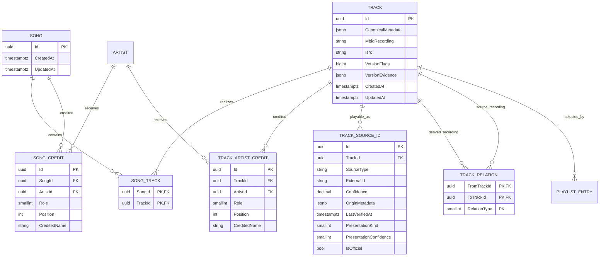

# Music song/version relation model

## Entity meanings

- `Song` is the underlying composition/work. A cover by another artist still
  realizes the same Song.
- `Track` is one exact recording/version: studio recording, acoustic
  re-recording, live performance, remix, remaster, cover, mashup, and so on.
- `TrackSourceId` is one playable provider object for an exact Track: a Spotify
  item, YouTube music video, YouTube lyrics video, cover-art upload, etc.
- `PlaylistEntry` keeps referencing an exact Track. Song-level substitution is
  sync policy and must not silently change the user's chosen version.
- `Artist` is shared by composition credits and recording/performance credits.

## Composition membership

`SongTrack` is deliberately many-to-many. Almost every Track has one Song, but
a mashup or medley can realize two or more Songs. It contains only `SongId` and
`TrackId`: `Role` or `Position` would duplicate version meaning and do not serve
a current query.

Membership means only "this recording realizes this composition." It does not
mean that every member is a safe substitute. Samples do not create membership;
they use `TrackRelation.Samples`. Automatic substitution must exclude
multi-Song Tracks, covers, mashups, and medleys unless user policy permits them.

- Primary key: `SongTrack (SongId, TrackId)`.
- Reverse covering index: `SongTrack (TrackId, SongId)`.

Both membership directions are therefore served by narrow two-column indexes.
Do not eagerly include memberships in provider identity or matching queries.

## Version flags and evidence

`Track.VersionFlags` is a C# `[Flags] enum : long`, stored as PostgreSQL
`bigint`. Initial flags are:

`Acoustic`, `Live`, `Instrumental`, `Orchestral`, `Remix`, `RadioEdit`,
`Extended`, `Demo`, `ACappella`, `Karaoke`, `Cover`, `Remastered`,
`ReRecorded`, `Clean`, `Explicit`, `Slowed`, `SpedUp`, `AlternateTake`,
`Medley`, and `Mashup`.

There are no `Mono` or `Stereo` flags. `None` means no special version type is
known; it does not assert that a Track is original or preferred. Do not add a
bitwise index until a measured consumer needs one.

`VersionEvidence` is optional current-state JSON for matching/review workflows.
It can retain per-flag confidence, rule version, source, and user override. It
is not an append-only audit ledger and is not part of ordinary Track projections.

## Credits

- `SongCredit` describes authorship of the composition: `Composer`, `Lyricist`,
  or `Writer`.
- `TrackArtistCredit` describes the exact recording/performance: `Primary`,
  `Featured`, `Remixer`, or `Producer`.
- `Position` exists on credit rows because display order is real data. It does
  not exist on `SongTrack`.

## Exact recording lineage

`TrackRelation` is optional evidence. Flags can say a Track is a remix, edit, or
remaster when its source recording is unknown; a relation is added only when
the exact source Track is known.

- Primary key: `(FromTrackId, ToTrackId, RelationType)`.
- Reverse index: `(ToTrackId, RelationType, FromTrackId)`.
- Initial types: `RemixOf`, `EditOf`, `RemasterOf`, `ReRecordingOf`,
  `DerivedFrom`, and `Samples`.
- Self-relations are rejected.

There is no cover-of table. A cover and the original realize the same
composition-level Song, have separate performance credits, and the cover Track
has the `Cover` flag.

## Provider presentation

`TrackSourceId` remains Cantaro's provider-link entity; there is no parallel
provider hierarchy. `PresentationKind` is `Unknown`, `Audio`, `CoverArtVideo`,
`LyricsVideo`, `MusicVideo`, `Visualizer`, or `LiveVideo`.
`PresentationConfidence` is 0-100, and nullable `IsOfficial` keeps uploader
authority separate from format.

Presentation is assigned only after an item resolves to the same exact
recording. Materially changed audio is a separate Track. Existing uniqueness
on `(SourceType, ExternalId)` remains the provider identity hot path.

## Storage and delivery

This graph-shaped model remains in PostgreSQL because current reads are indexed
one-hop lookups and playlist synchronization benefits from one foreign-keyed
transaction. Reconsider a graph database only after measuring deep,
variable-length traversals that PostgreSQL cannot serve acceptably.

The beta migration intentionally clears old canonical Tracks, Artists, source
links, credits, candidates, and resolved observation links rather than guessing
composition membership. Observations and playlist positions remain so matching
can rebuild the graph.

The sole production Track creation path creates one Song and one `SongTrack`
membership in the same `SaveChanges` transaction. Future import paths must use
the same invariant. Existing provider/matching reads continue to use explicit
projections or narrowly scoped includes so credits, sources, and memberships do
not create cartesian result multiplication.
